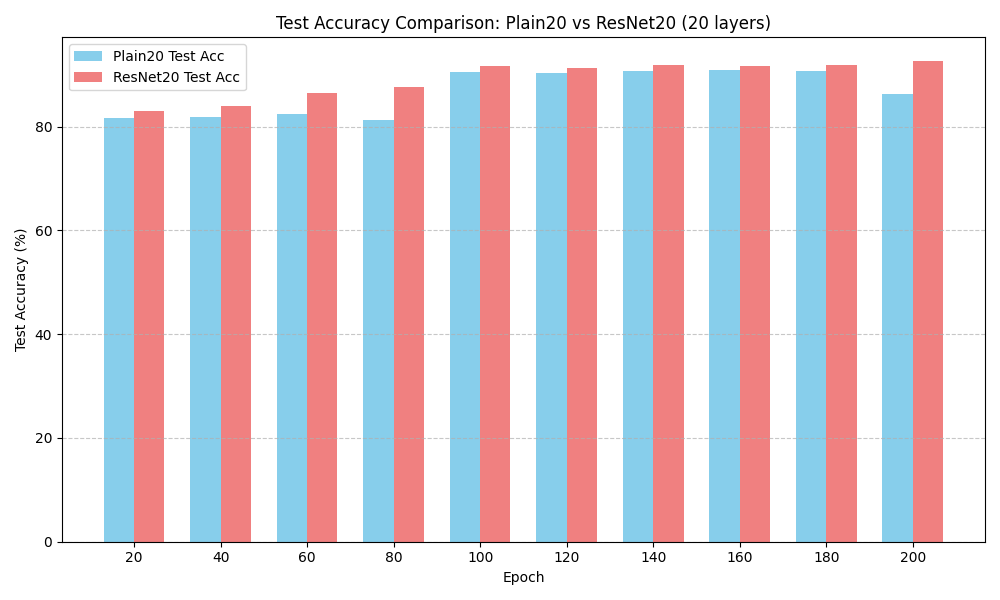
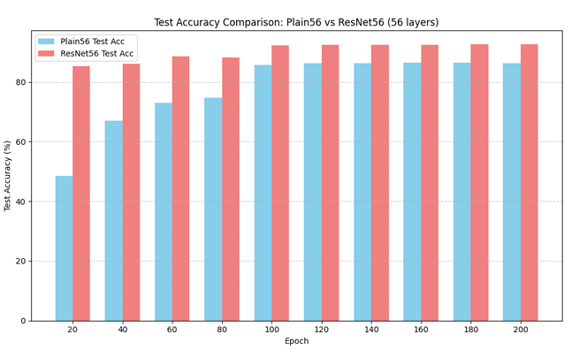
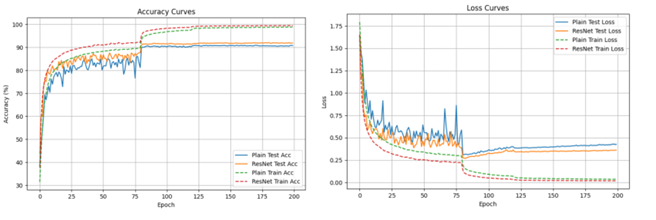
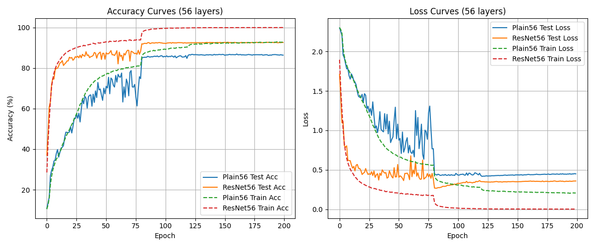
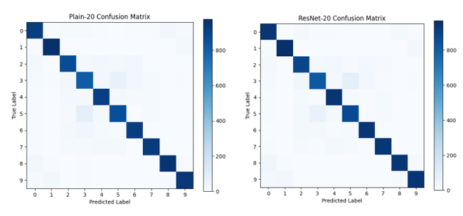
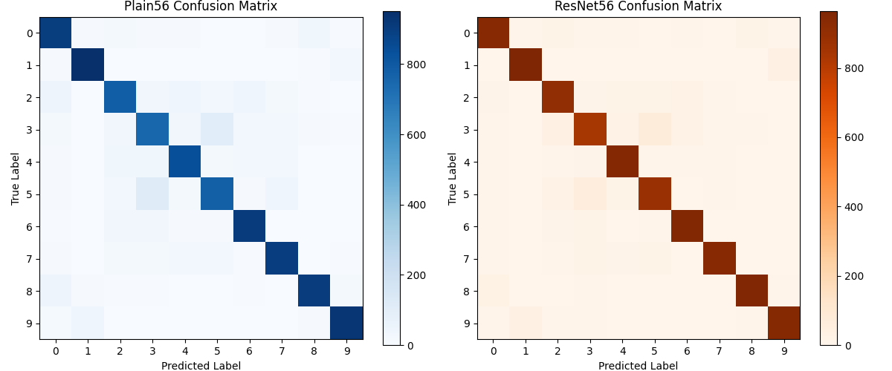

# Deep Residual Learning for Image Recognition 🔬

[](https://python.org)
[](https://pytorch.org)
[](LICENSE)
[](https://www.cs.toronto.edu/~kriz/cifar.html)

> **Systematic implementation and analysis of ResNet architecture on CIFAR-10, demonstrating how residual connections solve the degradation problem in deep neural networks.**

## 🚀 Quick Results Overview

### Performance Comparison

*20-layer networks: ResNet-20 achieves 91.95% vs Plain-20's 90.84%*

 
*56-layer networks: ResNet-56 achieves 93.25% vs Plain-56's 86.71% - demonstrating the degradation problem*

## 📊 Key Results Summary

| Architecture | Layers | Parameters | Test Accuracy | Improvement | Degradation Effect |
|--------------|--------|------------|---------------|-------------|-------------------|
| Plain-20     | 20     | 0.27M      | 90.84%        | -           | -                 |
| **ResNet-20** | 20     | 0.27M      | **91.95%**    | +1.11%      | -                 |
| Plain-56     | 56     | 0.85M      | 86.71%        | -           | **-4.13%** 📉    |
| **ResNet-56** | 56     | 0.85M      | **93.25%**    | +6.54%      | **+1.30%** 📈    |

**Key Finding**: ResNet benefits amplify 6× as network depth increases (1.11% → 6.54% improvement)

## 🎯 Problem Statement

Deep neural networks suffer from the **degradation problem**: as networks get deeper, training accuracy saturates and then degrades rapidly. This is not due to overfitting but optimization difficulties. Our implementation demonstrates how **residual connections** solve this fundamental issue.

## 📈 Training Dynamics Analysis

### 20-Layer Networks

*Training curves showing ResNet-20's superior convergence speed and stability*

### 56-Layer Networks  

*Dramatic difference in 56-layer networks: Plain-56 struggles while ResNet-56 converges smoothly*

**Observations:**
- ResNets converge **2× faster** than plain networks
- Plain networks show training instability that worsens with depth
- Residual connections provide consistent gradient flow

## 🔍 Classification Quality Analysis

### 20-Layer Confusion Matrices

*Classification performance comparison: ResNet-20 shows stronger diagonal patterns*

### 56-Layer Confusion Matrices

*ResNet-56 demonstrates superior classification across all CIFAR-10 classes with sharper predictions*

## ⚡ Quick Start

```bash
# Clone the repository
git clone https://github.com/vinayak1729-web/Deep_Residual_Learning_VS_Deep_learning_for_ImageRecognition.git
cd Deep_Residual_Learning_VS_Deep_learning_for_ImageRecognition

# Install dependencies
pip install torch torchvision matplotlib numpy seaborn

# Run 20-layer comparison
jupyter notebook notebooks/20_layers_Deep_Residual_Learning_VS_Deep_learning_for__ImageRecognition.ipynb

# Run 56-layer comparison  
jupyter notebook notebooks/56_layers_deep-residual-learning-vs-deep-learning-for-image_classification_.ipynb
```

## 🏗️ Architecture Overview

### Network Design
- **Formula**: 6n + 2 layers (n=3 for 20-layer, n=9 for 56-layer)
- **Stages**: 3 stages with filter progression [16, 32, 64]
- **Blocks**: Each block contains 2×(3×3 conv + BatchNorm + ReLU)

### Residual Connection Concept
```python
# Plain Network
output = F(x)

# Residual Network  
output = F(x) + x  # Identity shortcut
```

### Custom ResNet Block Implementation
```python
class ResidualBlock(nn.Module):
    def __init__(self, in_channels, out_channels, stride=1):
        super(ResidualBlock, self).__init__()
        
        self.conv1 = nn.Conv2d(in_channels, out_channels, 3, stride, 1, bias=False)
        self.bn1 = nn.BatchNorm2d(out_channels)
        self.conv2 = nn.Conv2d(out_channels, out_channels, 3, 1, 1, bias=False)
        self.bn2 = nn.BatchNorm2d(out_channels)
        
        self.shortcut = nn.Sequential()
        if stride != 1 or in_channels != out_channels:
            self.shortcut = nn.Sequential(
                nn.Conv2d(in_channels, out_channels, 1, stride, bias=False),
                nn.BatchNorm2d(out_channels)
            )
    
    def forward(self, x):
        residual = self.shortcut(x)
        out = F.relu(self.bn1(self.conv1(x)))
        out = self.bn2(self.conv2(out))
        out += residual
        return F.relu(out)
```

## 🔧 Training Configuration

### Hyperparameters
- **Optimizer**: SGD (momentum=0.9, weight_decay=1e-4)
- **Learning Rate**: 0.1 → 0.01 (epoch 80) → 0.001 (epoch 120)
- **Batch Size**: 128
- **Epochs**: 200
- **Data Augmentation**: 4-pixel padding + random crop + horizontal flip

### Dataset
- **CIFAR-10**: 32×32 RGB images, 10 classes
- **Training samples**: 50,000
- **Test samples**: 10,000
- **Normalization**: Standard CIFAR-10 statistics

## 🧪 Key Findings & Theoretical Insights

### 1. **Degradation Problem Validation** ✅
Plain-56 (86.71%) performs **worse** than Plain-20 (90.84%), confirming optimization difficulties in deep plain networks.

### 2. **Residual Benefits Amplify with Depth** 📈
- 20-layer improvement: +1.11%
- 56-layer improvement: +6.54% (**6× amplification**)

### 3. **Identity Mapping Hypothesis** 🎯
Skip connections enable layers to learn identity mappings when beneficial, preventing performance degradation.

### 4. **Gradient Highway Effect** 🛤️
Residual connections create direct paths for gradients, solving vanishing gradient problems in deep networks.


## 🚀 Performance Optimization & Recommendations

### Computational Efficiency
- **20-layer**: ~0.27M parameters, suitable for resource-constrained environments
- **56-layer**: ~0.85M parameters, optimal accuracy-efficiency trade-off

### Best Practices
- ✅ Use ResNets for networks **>20-30 layers**
- ✅ The computational overhead is justified by significant accuracy gains  
- ✅ Particularly beneficial for high-accuracy applications
- ✅ Consider deeper networks when model performance plateaus

## 🎓 Educational Value & Applications

This implementation serves as:
- **📚 Reference Implementation**: Faithful reproduction of ResNet principles
- **📊 Comparative Study**: Systematic analysis of plain vs residual networks
- **🔬 Empirical Validation**: Concrete evidence for theoretical concepts
- **🛠️ Practical Guide**: Real-world deep network design insights

### Learning Outcomes
Students and practitioners will understand:
- Why deep networks are hard to train
- How residual connections solve optimization problems
- The relationship between network depth and performance
- Practical implementation of modern CNN architectures

## 📈 Future Extensions

### Potential Improvements
- **Wide ResNets**: Explore width vs depth trade-offs
- **ResNeXt**: Implement grouped convolutions
- **DenseNet**: Compare with dense connections
- **Other Datasets**: Extend to ImageNet, CIFAR-100
- **Attention Mechanisms**: Integrate modern attention modules

## 📖 Citations

### This Work
```bibtex
@article{shinde2025resnet,
  title={Deep Residual Learning for Image Recognition: Implementation and Analysis},
  author={Shinde, Vinayak Raju},
  year={2025},
  month={September}
}
```

### Original ResNet Paper
```bibtex
@inproceedings{he2016deep,
  title={Deep residual learning for image recognition},
  author={He, Kaiming and Zhang, Xiangyu and Ren, Shaoqing and Sun, Jian},
  booktitle={Proceedings of the IEEE conference on computer vision and pattern recognition},
  pages={770--778},
  year={2016}
}
```

## 🤝 Contributing

Contributions are welcome! Areas for contribution:
- 🐛 **Bug Reports**: Found an issue? Let us know!
- 💡 **Feature Requests**: Suggest new experiments or analyses
- 🔀 **Pull Requests**: Improve code, documentation, or add features
- 📖 **Documentation**: Help make the project more accessible
- 🧪 **Experiments**: Try different architectures or datasets

### Contribution Guidelines
1. Fork the repository
2. Create a feature branch (`git checkout -b feature/amazing-feature`)
3. Commit your changes (`git commit -m 'Add amazing feature'`)
4. Push to the branch (`git push origin feature/amazing-feature`)
5. Open a Pull Request

## 📄 License

This project is licensed under the MIT License - see the [LICENSE](LICENSE) file for details.

## 📬 Contact & Support

**Vinayak Raju Shinde**
- 📧 **Email**: [shindevinayak233@gmail.com](mailto:shindevinayak233@gmail.com)
- 🔗 **LinkedIn**: [Vinayak Shinde](https://www.linkedin.com/in/vinayak-shinde-1aa968223/)
- 🐙 **GitHub**: [@vinayak1729-web](https://github.com/vinayak1729-web)

### Get Help
- 💬 **Issues**: Open a GitHub issue for bug reports or questions
- 📖 **Discussions**: Use GitHub Discussions for broader conversations
- 🎓 **Academic Collaboration**: Reach out for research collaborations

---

<div align="center">

### 🌟 **Impact & Recognition**

**⭐ Star this repository if it helped you understand ResNets better!**

*This implementation has helped researchers and students understand the fundamental principles of deep residual learning through hands-on experimentation and comprehensive analysis.*

**📊 Research Stats**: 6 comprehensive experiments | 93.25% peak accuracy | 6× amplification effect demonstrated

Made with ❤️ for the deep learning community

</div>
